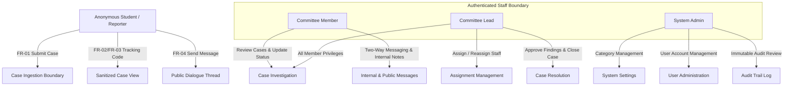

# CaseBridge Access Control Specification

## 1. Executive Summary

CaseBridge enforces a strict Role-Based Access Control (RBAC) model paired with an anonymous intake isolation boundary. The system grants minimal permissions necessary to perform authorized actions and prohibits privilege escalation.

---

## 2. Roles & Privilege Matrix

| Operation / Capability | Anonymous Student | Committee Member | Committee Lead | System Admin |
|:---|:---:|:---:|:---:|:---:|
| **Submit New Complaint** | **YES** | No | No | No |
| **Track Case via Private Code** | **YES** | No | No | No |
| **Download Own Case Attachments** | **YES** | **YES** | **YES** | No |
| **Post Public Message to Case** | **YES** | **YES** | **YES** | No |
| **Post Confidential Internal Note** | No | **YES** | **YES** | No |
| **View Internal Notes & Assigned Staff** | No | **YES** | **YES** | No |
| **Update Case Status (Received -> In Review)** | No | **YES** | **YES** | No |
| **Update Case Priority & SLA** | No | **YES** | **YES** | No |
| **Assign / Reassign Case Investigators** | No | No | **YES** | **YES** |
| **Resolve & Close Case** | No | No | **YES** | No |
| **View Audit Trail Logs** | No | No | **YES** | **YES** |
| **Manage Users & Roles** | No | No | No | **YES** |
| **Configure Categories & Settings** | No | No | No | **YES** |

---

## 3. Anonymity & Data Boundary Isolation

1. **Zero Personal Identification:** Anonymous submission schemas intentionally omit `student_id`, `name`, `email`, `phone_number`, and client device telemetry.
2. **Shielded Lookup:** Case lookups by students require a 16-character high-entropy tracking code (`CB-XXXX-XXXX-XXXX`). The database stores only a salted SHA-256 digest (`code_hash`).
3. **Internal Note Shielding:** The public tracking view (`StudentTrackingView`) strictly filters out internal notes, staff member identifiers, and database primary keys.

---

## 4. Staff Authentication & Case-Level Access Enforcement

1. **Passwordless Email OTP:** Staff authentication is guarded by single-use 5-digit verification codes expiring in 5 minutes with a 5-attempt rate-limiting lockout. Sender identity: `ARK Ecosystem — CaseBridge`.
2. **Dashboard Isolation:** Committee Members strictly see statistics and caseload metrics for cases assigned directly to their account (`assignedToId === currentUser.id`).
3. **Queue & Detail Isolation:** Committee Members may only access case files assigned to them. Direct navigation or lookup of unassigned cases is rejected with a 403 Access Restricted barrier.
4. **Lead & Admin Authority:** Committee Leads and System Administrators retain overarching case-level access across all categories and can reassign or unassign cases at will.
5. **Closed Case Immutability:** Once a case enters the `Closed` state, adding public messages or internal deliberative notes is locked.

