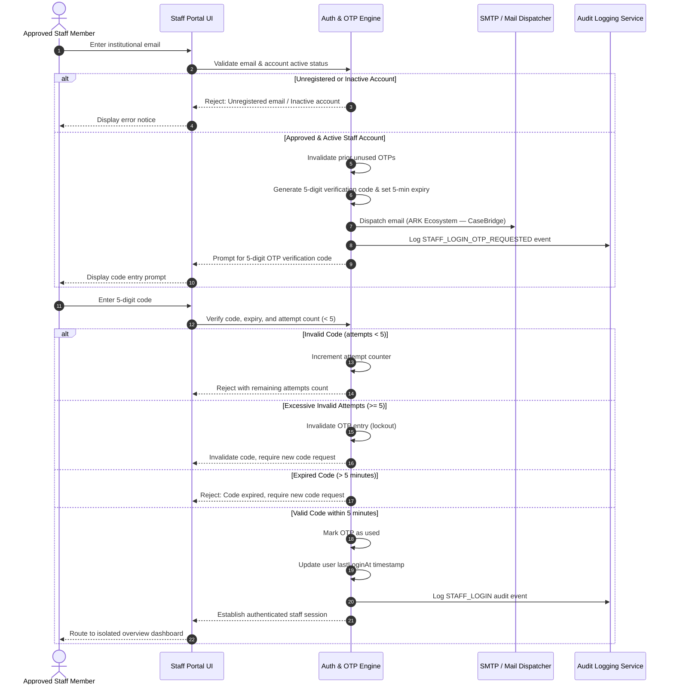

# CaseBridge Staff Portal Authentication & Case-Access Specification

## 1. Executive Summary

This document specifies the controlled Staff Portal authentication and case-access implementation within CaseBridge. The security model guarantees that:
1. Access to the Staff Portal is strictly restricted to approved, active institutional accounts.
2. Authentication is conducted via passwordless 5-digit Email One-Time Passwords (OTP) delivered under the **ARK Ecosystem — CaseBridge** sender identity.
3. User roles (`COMMITTEE_MEMBER`, `COMMITTEE_LEAD`, and `SYSTEM_ADMIN`) are recognized upon login.
4. Committee Members are isolated to only the cases assigned to their specific account, both in their dashboard statistics and case queue.
5. Direct navigation to unassigned case records by a Committee Member is rejected with an explicit access restriction (403).
6. Committee Leads and System Administrators retain overarching case-level access across all complaints.
7. Closed cases enforce communication immutability.

---

## 2. Authentication Flow: Passwordless Email OTP



### Key Security Parameters:
- **Code Length:** 5 decimal digits (`10000` to `99999`).
- **Expiry Window:** Exactly 5 minutes from generation.
- **Attempt Limit:** Maximum 5 attempts. Exceeding 5 attempts marks the OTP as invalidated.
- **Single-Use Enforcement:** An OTP is consumed and marked as `isUsed = true` upon successful login.
- **Sender Identity:** `ARK Ecosystem — CaseBridge` (`noreply@casebridge.ark`).

---

## 3. Staff Dashboard & Queue Isolation

| Role | Dashboard Caseload & Metrics | Case Queue Visibility | Assignment Privileges |
| :--- | :--- | :--- | :--- |
| **`COMMITTEE_MEMBER`** | **Strictly Isolated:** Metrics (Active Registry, In Review, Action Required, Overdue, Resolved) reflect **only** cases assigned to their account (`assignedToId === currentUser.id`). | **Strictly Isolated:** Only sees cases assigned to their account. Cannot view unassigned or other members' cases. | None. Cannot assign, reassign, or unassign cases. |
| **`COMMITTEE_LEAD`** | **Global Caseload:** Metrics and alerts reflect all university grievances across categories. | **Global Queue:** Full visibility into all cases. Can filter by All, Assigned to Me, or Unassigned. | Full assignment authority: assign, reassign, and unassign investigators. |
| **`SYSTEM_ADMIN`** | **Global Overview:** Complete institutional visibility into all cases, configuration, and audit trails. | **Global Queue:** Full visibility into all cases. | Full assignment authority alongside user management and category setup. |

---

## 4. Case-Level Staff Access & Messaging Rules

1. **Access Authorization Check (`canAccessCase`):**
   - If `role` is `SYSTEM_ADMIN` or `COMMITTEE_LEAD` -> **Permitted** (`true`).
   - If `role` is `COMMITTEE_MEMBER` -> **Permitted ONLY IF** `case.assignedToId === currentUser.id`.
   - If unassigned or assigned to another member -> **Denied** (`false`).
2. **Access Denial Enforcement:**
   - Navigating to `/portal/cases/:id` without authorization displays the **Access Restricted (403)** screen:
     > *"This case record is not assigned to your staff profile. Under CaseBridge institutional policy, Committee Members may only access and review cases specifically assigned to their account."*
3. **Communication Controls:**
   - Authorized staff may post official committee responses (public to the student tracking view) or internal deliberative notes (shielded from the student).
   - If a case status is `Closed`, adding new messages or internal notes is strictly prohibited across all roles.

---

## 5. Configuration & Environment Integration

### Environment Variables (`.env.example`):
```bash
# SMTP Email Configuration (Passwordless Staff OTP Login & Escalations)
# ARK Ecosystem — CaseBridge mail dispatcher configuration
SMTP_HOST=smtp.mailgun.org
SMTP_PORT=587
SMTP_USER=casebridge-mailer
SMTP_PASSWORD=change_me_to_smtp_password
SMTP_USE_TLS=true
SMTP_FROM_NAME=ARK Ecosystem — CaseBridge
SMTP_FROM_EMAIL=noreply@casebridge.ark
```

### Python Backend & SQLite / MySQL Compatibility:
- Flask blueprint route `/committee/login` supports both passwordless email OTP verification and standard session initialization.
- Model `StaffLoginOtp` records salted SHA-256 hashes of verification codes with `ix_staff_otp_lookup` index.
- Rate-limiting prevents brute-force OTP extraction (`@limiter.limit("15 per minute")`).

---

## 6. Verification & Test Suite Summary

The verification suite (`tests/test_staff_auth_and_access.test.ts`) confirms 100% compliance across all 14 targeted assertions:
1. `rejects OTP requests for unregistered or unapproved email addresses` - **PASS**
2. `rejects OTP requests for deactivated / disabled staff accounts` - **PASS**
3. `successfully generates and dispatches a 5-digit OTP for active approved staff` - **PASS**
4. `authenticates approved staff upon entering the correct 5-digit OTP` - **PASS**
5. `enforces single-use consumption: an OTP cannot be reused after successful authentication` - **PASS**
6. `tracks invalid attempts and locks out after 5 consecutive failures` - **PASS**
7. `rejects expired verification codes beyond the 5-minute window` - **PASS**
8. `correctly recognizes all 3 institutional roles and their privileges` - **PASS**
9. `enforces staff dashboard isolation: Committee Members only see statistics for assigned cases` - **PASS**
10. `restricts Committee Members from accessing cases not assigned to them` - **PASS**
11. `grants Committee Members access to cases assigned to them` - **PASS**
12. `grants Committee Leads and System Admins access to all cases unconditionally` - **PASS**
13. `records official messages and audit logs when authorized staff responds` - **PASS**
14. `prohibits messaging on closed cases` - **PASS**

All 8 test suites (75 total tests) pass cleanly without regression.
