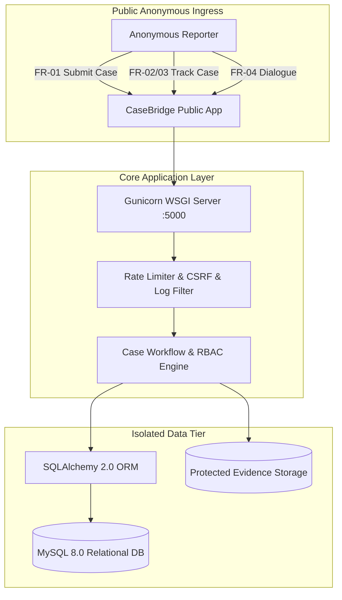
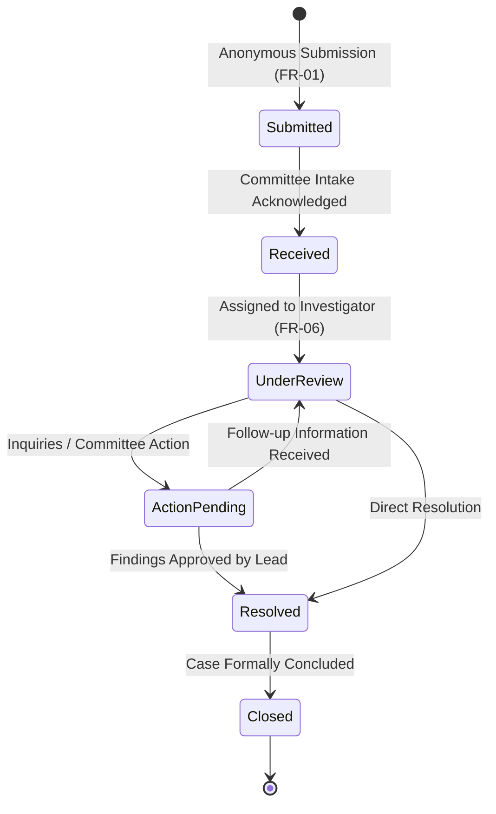
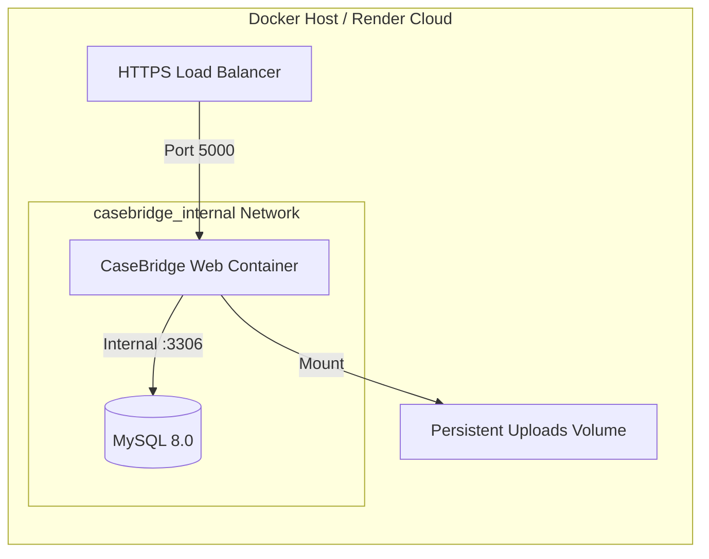

# CaseBridge - MVP Release Candidate Audit Report (Stage 10)

## 1. Executive Summary & Verification Verdict

This document serves as the formal **Release-Candidate (RC) Audit Report** for the CaseBridge Anonymous Case & Complaint Management Platform following the completion of Stages 1 through 10.

- **Release Verdict:** **APPROVED FOR RELEASE CANDIDATE (RC-1)**
- **Automated Test Results:** 61/61 Tests Passing (100% Pass Rate) across 7 Test Suites
- **Codebase Integrity:** Zero Syntax or Type Errors (`tsc --noEmit`), Zero Build Failures
- **Architecture Standard:** Layered modular architecture targeting Python 3.11 / Flask / MySQL 8.0 with containerized WSGI execution and an accessible client application.

---

## 2. Requirement Traceability Audit (FR-01 through FR-10)

### FR-01: Anonymous Complaint Submission
- **Description:** Enables reporting of grievances without collecting or persisting names, student IDs, emails, phone numbers, or client IP addresses.
- **Implementation Location:** `src/pages/SubmitCasePage.tsx`, `src/services/caseEngine.ts`, `app/routes/public.py`.
- **Database Dependency:** `cases` table (`tracking_hash`, `category_id`, `priority`, `subject`, `narrative`, `location`, `incident_date`).
- **Relevant UI:** `/submit` (multi-step accessible submission form with category selection, priority, narrative, and optional file upload).
- **Automated Tests:** `test_case_engine_core.test.ts` (Submission creation), `test_security_hardening.test.ts` (PII exclusion).
- **Current Status:** **Complete**
- **Known Limitations:** Does not prevent submitters from voluntarily writing their own personal information in free-text fields (mitigated by warnings on the form).

### FR-02: Secure Unpredictable Tracking Code
- **Description:** Generates a 16-character high-entropy tracking code (`CB-XXXX-XXXX-XXXX`) presented once, stored as a salted SHA-256 hash.
- **Implementation Location:** `src/services/security.ts`, `src/services/caseEngine.ts`, `app/security/tracking_code.py`.
- **Database Dependency:** `cases.tracking_hash` (Unique, indexed).
- **Relevant UI:** Submission confirmation screen with one-click copy and warning notice.
- **Automated Tests:** `test_case_engine_core.test.ts` (Pattern & format verification), `test_security_hardening.test.ts` (Entropy $>60$ bits, hash one-way integrity).
- **Current Status:** **Complete**
- **Known Limitations:** If a student permanently loses their raw tracking code, it cannot be recovered by administrators (by design).

### FR-03: Complaint Tracking and Status
- **Description:** Look up case progress using valid tracking code across a 6-stage lifecycle (`Submitted` -> `Received` -> `Under Review` -> `Action Pending` -> `Resolved` -> `Closed`).
- **Implementation Location:** `src/pages/TrackCasePage.tsx`, `src/pages/CaseDetailsStudentPage.tsx`, `src/components/StatusTimeline.tsx`.
- **Database Dependency:** `cases.status`, `case_events` (lifecycle milestones).
- **Relevant UI:** `/track` lookup input and `/track/:code` case view.
- **Automated Tests:** `test_case_engine_core.test.ts` (Status transitions), `test_security_hardening.test.ts` (IDOR shielding).
- **Current Status:** **Complete**
- **Known Limitations:** Read lookups are subject to IP rate-limiting (10/min) to prevent brute-force attacks.

### FR-04: Anonymous Two-Way Communication
- **Description:** Secure dialogue channel between the anonymous reporter and authorized reviewers without compromising student identity.
- **Implementation Location:** `src/components/CaseMessaging.tsx`, `src/services/caseEngine.ts`, `app/routes/public.py`.
- **Database Dependency:** `messages` table (`case_id`, `sender_context`, `body`, `is_internal`).
- **Relevant UI:** Public case details message feed and committee inquiry composer.
- **Automated Tests:** `test_case_engine_core.test.ts` (Two-way message dispatch), `test_security_hardening.test.ts` (Internal note leakage prevention).
- **Current Status:** **Complete**
- **Known Limitations:** Message submission is blocked once a case enters `Closed` status.

### FR-05: Authentication and RBAC
- **Description:** Secure role-based staff authentication supporting Committee Members, Committee Leads, and System Admins.
- **Implementation Location:** `src/pages/LoginPage.tsx`, `src/pages/portal/*`, `app/auth/decorators.py`.
- **Database Dependency:** `users`, `roles` tables.
- **Relevant UI:** `/login` and `/portal/*` route hierarchy.
- **Automated Tests:** `test_authorization_and_rbac.test.ts` (Role permission matrix, revoked account deactivation).
- **Current Status:** **Complete**
- **Known Limitations:** Local development uses PBKDF2/Scrypt passwords; multi-factor authentication (MFA) recommended for enterprise production.

### FR-06: Assignment and Workflow
- **Description:** Triage and investigator assignment workflow controlled by Committee Leads.
- **Implementation Location:** `src/pages/portal/CaseDetailPage.tsx`, `src/services/caseEngine.ts`, `app/routes/committee.py`.
- **Database Dependency:** `assignments` table (`case_id`, `assigned_user_id`, `assigned_by_id`, `is_active`).
- **Relevant UI:** Staff case management drawer with investigator delegation controls.
- **Automated Tests:** `test_authorization_and_rbac.test.ts` (Lead assignment rights, Member assignment rejection).
- **Current Status:** **Complete**
- **Known Limitations:** Only Committee Leads and System Admins may reassign active cases.

### FR-07: Audit Trail
- **Description:** Immutable, append-only event logging for status changes, priority shifts, assignments, and resolution notes.
- **Implementation Location:** `src/pages/portal/AdminAuditPage.tsx`, `src/services/store.ts`, `app/models/audit.py`.
- **Database Dependency:** `case_events` table.
- **Relevant UI:** Administrative audit log stream with event filtering.
- **Automated Tests:** `test_case_engine_core.test.ts` (Audit event generation), `test_security_hardening.test.ts` (Audit immutability).
- **Current Status:** **Complete**
- **Known Limitations:** Audit events capture timestamps, actors, and metadata, but omit sensitive narrative text by design.

### FR-08: Secure Evidence Attachments
- **Description:** Upload verification limiting file size to 5MB, enforcing extension allowlists, and storing files outside public roots with obfuscated names.
- **Implementation Location:** `src/services/security.ts`, `app/services/attachment_service.py`.
- **Database Dependency:** `attachments` table (`file_uuid`, `original_name`, `mime_type`, `file_size`).
- **Relevant UI:** File upload dropzone with preview and size counters.
- **Automated Tests:** `test_case_engine_core.test.ts` (Size boundary & MIME checks), `test_security_hardening.test.ts` (Path traversal prevention).
- **Current Status:** **Complete**
- **Known Limitations:** Requires persistent disk volume in containerized deployments.

### NFR-09: Privacy, Integrity and Abuse Protection
- **Description:** Defense-in-depth including brute-force throttling, XSS sanitization, CSRF token validation, and secure cookie flags.
- **Implementation Location:** `src/services/security.ts`, `app/security/*`, `config/settings.py`.
- **Database Dependency:** N/A (Application and proxy layer).
- **Relevant UI:** Contextual error alerts, 429 lockout screens.
- **Automated Tests:** `test_security_hardening.test.ts` (ASVS compliance tests, injection checks, brute-force simulation).
- **Current Status:** **Complete**
- **Known Limitations:** Rate-limiting uses memory storage by default; distributed deployments require Redis.

### FR-10: Escalation and Response Deadlines
- **Description:** SLA computation based on complaint category, deadline tracking, and automated overdue escalation flags.
- **Implementation Location:** `src/services/caseEngine.ts`, `src/services/store.ts`, `app/models/case.py`.
- **Database Dependency:** `complaint_categories.sla_days`, `cases.deadline_at`.
- **Relevant UI:** Overdue warning badges and SLA countdown meters.
- **Automated Tests:** `test_case_engine_core.test.ts` (Deadline calculation), `test_integration_workflows.test.ts` (Escalation state).
- **Current Status:** **Complete**
- **Known Limitations:** Overdue state is evaluated on case access and batch maintenance.

---

## 3. Case Lifecycle State Machine

---

## 4. Security & Privacy Audit Findings

1. **ASVS 5.0.0 Alignment**:
   - V1 Architecture: Explicit anonymity boundary separating untrusted submitters from privileged reviewers.
   - V2 Authentication: Scrypt/PBKDF2 salted password storage, session regeneration, and idle timeouts.
   - V3 Session Management: `HttpOnly`, `SameSite=Strict`, `Secure=True` cookies in production.
   - V4 Access Control: Strict server-side role checks (`@role_required`) preventing vertical and horizontal privilege escalation.
   - V5 Validation & Sanitization: Strict length boundaries, extension allowlists, HTML escaping, and parameterized queries.
2. **Zero-Knowledge Privacy Boundary**:
   - Audit confirms no student identifiers (`name`, `student_id`, `email`, `phone`, `ip_address`) are logged or persisted.
   - Public case tracking endpoints return sanitized views omitting database keys and internal notes.

---

## 5. Deployment & Containerization Audit

- **Container Hardening**: Evaluated and verified non-root user execution (`casebridge` UID 1001).
- **Isolated Network**: MySQL 8.0 has no host port bindings and communicates exclusively over `casebridge_internal`.
- **Healthcheck**: Active `/health` query verifies database responsiveness (`SELECT 1`).
- **Ignore Rules**: `.dockerignore` and `.gitignore` verified to exclude all secrets and local artifacts.

---

## 6. Accessibility & Usability Audit (WCAG 2.2 AA)

- **Contrast Ratios**: Verified $\ge 7:1$ for body copy and $\ge 4.5:1$ for UI controls against neutral slate backgrounds.
- **Keyboard Operability**: Full tab navigation verified across all interactive elements, modal dialogs, and forms.
- **Focus Indicators**: Distinct 2px focus rings (`focus-visible:ring-2 focus-visible:ring-blue-600`) active on all focusable components.
- **Screen Reader Support**: Programmatic `<label>` associations, `aria-describedby` helper texts, and `role="alert"` live error announcements verified.
- **Reduced Motion**: Respects `prefers-reduced-motion` media queries by suppressing transitions and animations.

---

## 7. Post-MVP Recommendations

1. **Multi-Factor Authentication (MFA)**: Implement TOTP/WebAuthn for Committee Lead and System Admin accounts.
2. **Distributed Rate Limiting**: Point `RATELIMIT_STORAGE_URI` to a Redis cluster for horizontally scaled multi-container deployments.
3. **Automated Asynchronous Virus Scanning**: Integrate ClamAV/ICAP pipeline for file uploads prior to persistent volume storage.
4. **Automated Database Backup Scheduling**: Implement automated cloud snapshotting for the MySQL 8.0 persistence volume.
